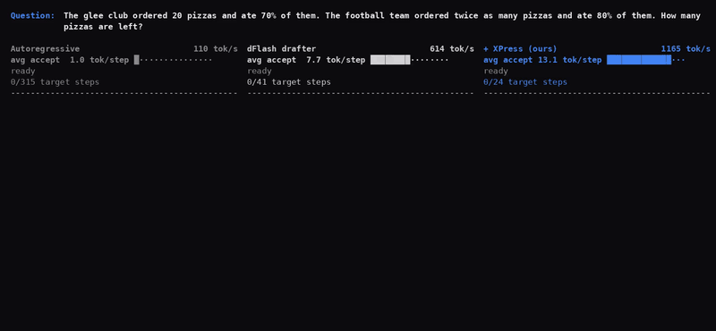
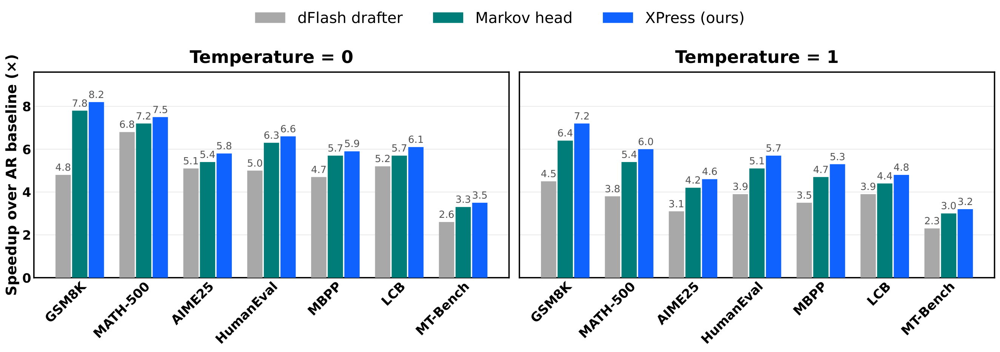
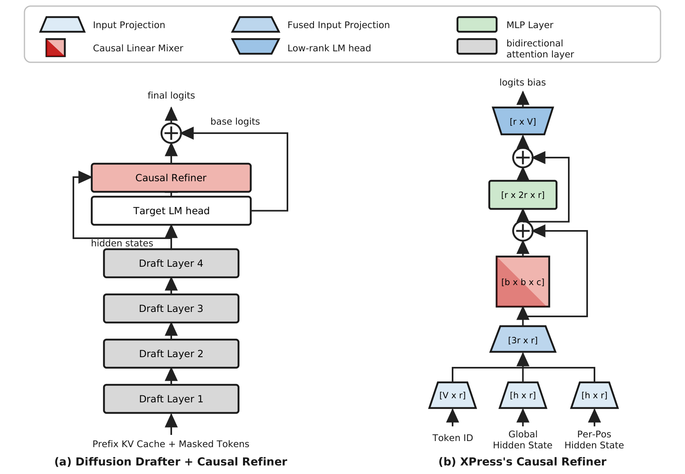

<div align="center">
<h1>XPress: Parallel Refinement for Diffusion Drafters in Speculative Decoding</h1>

<p align="center">
  <a href="https://github.com/Supercomputing-System-AI-Lab/xPress">
    
  </a>
  <a href="https://arxiv.org/abs/2608.02438">
    
  </a>
</p>

</div>

---

<p align="center">
  
</p>

<p align="center">
<em><b>Case study.</b> A real GSM8K prompt decoded three ways under the same timing setup:
autoregressive, the dFlash drafter alone, and xPress (ours). Each pane advances by the tokens
it accepts per target-verification step, so xPress finishes first. Once the dFlash drafter
finishes, the autoregressive pane is fast-forwarded (&raquo;&raquo;) so you are not left watching
it crawl. Measured on a single H200 at batch 1; the acceptance lengths shown are for this one
prompt, not the dataset averages reported below.</em>
</p>

---

## 🧠 Abstract

Block-diffusion drafters like dFlash generate an entire block of draft tokens in a single forward pass, drastically reducing the overhead of multiple-token drafting in speculative decoding. The crucial final step of the single-pass discrete denoising process involves using the logit distribution at each position to sample conditionally independent tokens. The resulting draft is thus a set of per-position marginals, rather than a joint distribution: no draft token is guaranteed to depend on its predecessors. Such independently sampled marginals tend to produce sequences with tokens that are individually likely, but jointly improbable under the target model's distribution, which verifies each token conditionally. This can cause early rejection and limits acceptance length. To address this, we propose **xPress** as a means to restore the missing causality in diffusion drafters. xPress is a lightweight causal refiner that reconciles the whole diffusion block at once through parallel refinement, restoring and propagating causal dependencies across the draft without a token-by-token loop. On Qwen3-8B, across seven math, code, and chat benchmarks, xPress raises **acceptance length by ~30% on average (up to +56%)** and its end-to-end decoding throughput by **~1.3× on average (up to 1.7×)** compared to the original dFlash diffusion drafter.


<p align="center">
  
</p>

<p align="center">
<em>End-to-end decoding speedup over autoregressive baseline (Qwen3-8B, block 16, batch 1).
xPress improves on the dFlash drafter at both temperatures on every benchmark, and the gains
survive lossless sampling.</em>
</p>

---

## 🔍 How it works

XPress adds a small causal refiner on top of the drafter (left). The refiner turns the
drafter's logits into a corrected block by conditioning each position on the previous block
token, and the block is resolved with K parallel Jacobi passes instead of a left-to-right
loop.

Everything but the two vocabulary projections lives in an `r`-dimensional bottleneck
(`r = 256`, right), which makes the head roughly 16× lighter than working at the model's
hidden size:

<p align="center">
  
</p>

<p align="center">
<em>(a) the diffusion drafter with the causal refiner in the loop. The refiner reads the
drafter's hidden states and adds a logit bias on top of the target LM head's base logits.
(b) inside the refiner: previous-token embedding, per-position and block-global hidden states
are fused to <code>r</code>, mixed causally across the block, passed through an
<code>r</code>-space SwiGLU MLP, and read out to the vocabulary as a bias.</em>
</p>

---

## 📋 What's in this repo

The exact HF-based harness that produced the paper's acceptance-length and throughput numbers (Qwen3-8B target, dFlash-b16 drafter, block 16), plus a self-contained vLLM serving integration:

| Component | Path |
|---|---|
| Main eval harness (timed loop + fair-interleave protocol) | `benchmark_compile_all.py` |
| Model loading / warmup / torch.compile helpers | `bench_utils.py` |
| Throughput & acceptance metrics, latency profiles | `bench_metrics.py` |
| dFlash drafter + spec-decode loop (T=1 lossless verification) | `model/dflash.py` |
| Dataset loading + prompt templates (part of the protocol) | `model/utils.py` |
| xPress refiner head (self-contained torch) | `refiners/xpress_head.py` |
| xPress loader + par-K Jacobi rollout + CUDA-graph runner | `refiners/xpress.py` |
| Markov-head baseline (drives DeepSpec's own implementation) | `refiners/markov.py` |
| Vendored, unmodified DeepSpec code (see `PROVENANCE.md`) | `refiners/deepspec/` |
| Published protocol, T=0 and T=1 in one script | `bench_fair_fast.sh` |
| **vLLM serving**: xPress source + install script + benchmarks | `vllm_xpress/` |

---

## 🚀 Getting Started

### 🖥️ Environment Setup

```bash
conda create -n xpress python=3.11 -y
conda init bash && exec $SHELL      # skip if `conda activate` already works in your shell
conda activate xpress
pip install -r requirements.txt
```

> **Notes**
> - All reported acceptance lengths and throughputs were measured on a single **NVIDIA H200**. Verified with `torch==2.11.0+cu129`. Any CUDA 12.x-capable node works. If your driver is older than the wheel's CUDA, prepend the compat layer, e.g. `export LD_LIBRARY_PATH=/usr/local/cuda-13.0/compat:$LD_LIBRARY_PATH`.
> - `flash-attn` is OPTIONAL: the harness auto-falls back to torch SDPA (published numbers were measured with SDPA).
> - First run compiles Triton/inductor kernels (~5 min); later runs reuse the cache (`./inductor_cache`, override with `INDUCTOR_CACHE=...`).

### 📦 Checkpoints

Checkpoints are passed **by Hugging Face repo id** and download automatically:

| checkpoint | contents |
|---|---|
| [`UIUC-SSAIL/Qwen3-8B-XPress-b16`](https://huggingface.co/UIUC-SSAIL/Qwen3-8B-XPress-b16) | xPress head + its co-trained drafter (and the vLLM serving format) |
| [`UIUC-SSAIL/Qwen3-8B-Markov-b16`](https://huggingface.co/UIUC-SSAIL/Qwen3-8B-Markov-b16) | Markov-head baseline + its co-trained drafter |

To use local files instead, point `XPRESS_CKPT` / `MK_CKPT` (or `--xpress-refiner-path` / `--markov-refiner-path`) at a `.pt` path.

---

## ⚖️ Reproduce the paper numbers

One script for both temperatures — `./bench_fair_fast.sh <dataset> [temperature]`:

```bash
# T=0 acceptance + paired throughput (published protocol; interleaved rounds,
# warmup discarded, paired ratios):
./bench_fair_fast.sh gsm8k
# T=1 lossless sampling (frozen-Gumbel + honest-q verification):
./bench_fair_fast.sh gsm8k 1
# All benchmarks: gsm8k math500 humaneval mbpp aime25 livecodebench mt-bench
```

Bare-drafter baseline (the `drafter` column below): pass `--drafter-only` to `benchmark_compile_all.py` (draft = the drafter's own K=0 seed, no refiner; works with or without `--use-graph` — the seed sampling itself is CUDA-graphed).

Single-method / custom runs go through `benchmark_compile_all.py` directly (see `--help`); the `.sh` wrapper only sets the published protocol.

### 📊 Results

Both temperatures, all seven benchmarks: **speedup over the autoregressive baseline (Sp.)** and
the **acceptance length (τ)** that produces it, against the plain dFlash drafter and the
Markov-head baseline.

Each entry reports the **throughput-optimal K** for that setting: `bench_fair_fast.sh` sweeps
`K_LIST=4,5,6,7`, and the numbers below are the K with the best tok/s together with the acceptance
length measured at that same K.

**Temperature = 0**

| benchmark | dFlash Sp. | τ | Markov Sp. | τ | xPress Sp. | τ | × Gain |
|---|:---:|:---:|:---:|:---:|:---:|:---:|:---:|
| GSM8K | 4.8× | 6.48 | 7.8× | 9.67 | **8.2×** | **10.11** | 1.70× |
| MATH-500 | 6.8× | 7.71 | 7.2× | 9.24 | **7.5×** | **9.62** | 1.10× |
| AIME25<sup>†</sup> | 5.1× | 7.10 | 5.4× | 7.95 | **5.8×** | **8.35** | 1.12× |
| HumanEval | 5.0× | 6.44 | 6.3× | 7.76 | **6.6×** | **8.15** | 1.32× |
| MBPP | 4.7× | 5.75 | 5.7× | 6.90 | **5.9×** | **7.11** | 1.25× |
| LiveCodeBench | 5.2× | 7.11 | 5.7× | 7.85 | **6.1×** | **8.40** | 1.17× |
| MT-Bench | 2.6× | 3.18 | 3.3× | 4.13 | **3.5×** | **4.38** | 1.36× |
| **Avg.** | 4.9× | 6.25 | 6.1× | 7.64 | **6.2×** | **8.02** | **1.29×** |

**Temperature = 1** (lossless sampling; τ averaged over 5 seeds)

| benchmark | dFlash Sp. | τ | Markov Sp. | τ | xPress Sp. | τ | × Gain |
|---|:---:|:---:|:---:|:---:|:---:|:---:|:---:|
| GSM8K | 4.5× | 5.83 | 6.4× | 8.76 | **7.2×** | **9.20** | 1.60× |
| MATH-500 | 3.8× | 5.71 | 5.4× | 7.60 | **6.0×** | **8.12** | 1.58× |
| AIME25<sup>†</sup> | 3.1× | 4.35 | 4.2× | 6.22 | **4.6×** | **6.68** | 1.48× |
| HumanEval | 3.9× | 5.40 | 5.1× | 6.99 | **5.7×** | **7.36** | 1.46× |
| MBPP | 3.5× | 4.83 | 4.7× | 6.39 | **5.3×** | **6.68** | 1.51× |
| LiveCodeBench | 3.9× | 5.58 | 4.4× | 6.43 | **4.8×** | **6.65** | 1.23× |
| MT-Bench | 2.3× | 2.90 | 3.0× | 3.97 | **3.2×** | **4.13** | 1.39× |
| **Avg.** | 3.6× | 4.94 | 4.7× | 6.62 | **5.3×** | **6.97** | **1.46×** |

`Sp.` = speedup over the autoregressive baseline; `τ` = acceptance length (mean accepted tokens per
verification step); **× Gain** = xPress's throughput over the plain dFlash drafter. Qwen3-8B with a
dFlash block-16 drafter, single-sequence decoding, at most 2048 generated tokens, on a single H200.


Tolerances: acceptance ±0.1 (bf16 varies slightly across GPU models/driver stacks). Absolute tok/s depends on your node. The **paired ratio** printed by the interleaved script is the number to compare.


---

## ⚡ Serving with vLLM

[`vllm_xpress/`](vllm_xpress/) runs xPress as a first-class vLLM V1 speculative-decoding method. Our implementation lives there as **readable source** (`vllm_xpress/src/vllm/...`: the refiner head, the draft model, the speculator and its Triton kernels); the only edits to existing upstream files are ~48 lines of method registration in [`registration.patch`](vllm_xpress/registration.patch). `setup_vllm.sh` clones upstream vLLM at a pinned commit, installs our files, and self-checks the result:

```bash
conda create -n vllm-xpress python=3.11 -y && conda activate vllm-xpress
cd vllm_xpress && ./setup_vllm.sh
python bench_vllm_accept.py --dataset gsm8k --max-samples 128           # xPress
python bench_vllm_accept.py --method dspark --dataset gsm8k --max-samples 128   # Markov baseline
```

See [`vllm_xpress/README.md`](vllm_xpress/README.md) for the serving checkpoint, the K/batch sweeps, and the runtime log lines that confirm the integration is active.

---

## 🙏 Attribution

The Markov-head **baseline** runs DeepSeek's own implementation, vendored verbatim under `refiners/deepspec/`. See [`refiners/deepspec/PROVENANCE.md`](refiners/deepspec/PROVENANCE.md). Everything under `refiners/xpress*` is ours.

---

## 📚 Citation

If you find our work useful or relevant to your project and research, please kindly cite:

```bibtex
@misc{wang2026xpress,
      title={xPress: Parallel Refinement for Diffusion Drafters in Speculative Decoding},
      author={Zheng Wang and Davis Wertheimer and Yu Chin Fabian Lim and Mudhakar Srivatsa and Raghu K. Ganti and Minjia Zhang and Naigang Wang},
      year={2026},
      eprint={2608.02438},
      archivePrefix={arXiv},
      primaryClass={cs.AI},
      url={https://arxiv.org/abs/2608.02438},
}
```
